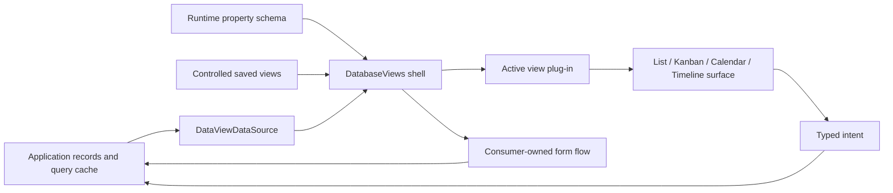

# Architecture and ownership

The package is controlled at every persistent boundary. It owns interaction;
the application owns truth.

## Ownership table

| Concern | Library | Consumer |
| --- | --- | --- |
| DOM, layout, focus, keyboard, pointer sessions | Owns | Can customize via supported slots |
| Loaded record snapshot | Reads | Owns |
| Fetching/cache/pagination policy | Displays and requests | Owns |
| Saved views and active id | Renders controlled values | Owns persistence |
| Search/filter/sort/group descriptors | Defines and emits | Applies on server and persists |
| Selection | Transient per shell | Receives record intents |
| Optimistic projection | Coordinates per engine | Accepts/rejects and supplies authority |
| Create/edit forms | Supplies surfaces/fields | Owns state, validation, submit, routing |
| Permissions | Enforces supplied flags | Owns authorization decision |
| Theme defaults and semantic tokens | Owns | Overrides tokens/scoped theme |
| Domain renderers | Provides usable defaults | May replace record/property rendering |

## Component layers

Each engine follows store → presentational pieces → provider/container. Engine
stores are per-provider and never contain fetched server records. The database
shell’s Zustand store contains only transient menu and selection state, with
actions grouped under `actions`.

`chrome={{mode: "standalone"}}` renders engine controls. Embedded surfaces
force `chrome={{mode: "embedded"}}`; the database shell owns its title header,
view tabs, global search, saved query controls, and record action. A temporary
deprecated `showHeader` prop exists only for source migration.

## Plug-ins

A plug-in is a pure registry entry with an id, label, optional icon, and render
function. Built-ins use ids `list`, `kanban`, `calendar`, and `timeline`.
Custom saved definitions use `{type: "custom", pluginId, config}` so unknown
third-party ids never weaken built-in discriminated unions.
