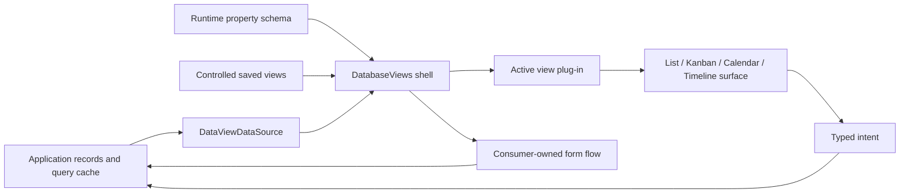

# Architecture and ownership

The package is controlled at every persistent boundary. It owns interaction;
the application owns truth.

```mermaid
flowchart LR
  A["Application records and query cache"] --> B["DataViewDataSource"]
  S["Runtime property schema"] --> C["DatabaseViews shell"]
  V["Controlled saved views"] --> C
  B --> C
  C --> P["Active view plug-in"]
  P --> L["List / Kanban / Calendar / Timeline surface"]
  L --> I["Typed intent"]
  I --> A
  C --> F["Consumer-owned form flow"]
  F --> A
```

## Ownership table

| Concern | Library | Consumer |
| --- | --- | --- |
| DOM, layout, focus, keyboard, pointer sessions | Owns | Can customize via supported slots |
| Loaded record snapshot | Reads | Owns |
| Fetching/cache/pagination policy | Displays and requests | Owns |
| Saved views and active id | Renders controlled values | Owns persistence |
| Search/filter/sort/group descriptors | Defines and emits | Applies on server and persists |
| Selection | Transient per shell | Receives record intents |
| Optimistic projection | Coordinates per engine | Accepts/rejects and supplies authority |
| Create/edit forms | Supplies surfaces/fields | Owns state, validation, submit, routing |
| Permissions | Enforces supplied flags | Owns authorization decision |
| Theme defaults and semantic tokens | Owns | Overrides tokens/scoped theme |
| Domain renderers | Provides usable defaults | May replace record/property rendering |
| View tabs, search, settings, and New action | Owns and renders once | Supplies controlled state and handles intents |
| Engine navigation | Calendar/Timeline render it inside the engine | Supplies controlled view preferences |

## Component layers

Each engine follows store → presentational pieces → provider/container. Engine
stores are per-provider and never contain fetched server records. The database
shell’s Zustand store contains only transient menu and selection state, with
actions grouped under `actions`.

`DatabaseViews` has one fixed composition contract. Its top row owns saved-view
tabs, Add view, global search, active-view settings, and New. Consumers do not
recreate or hide that row. The active engine renders below it.

Calendar and Timeline always render a second, engine-specific header for date
navigation, Today, mode, and zoom. List and Kanban do not need an idle engine
header, so they render the surface directly; contextual selection actions may
appear only while records are selected. There is no `chrome` or `showHeader`
switch. `*Surface` exports are compatibility aliases with the same required
engine composition, not a header-hiding escape hatch.

Settings are derived from the active saved-view definition and emitted through
`onViewsChange`. `settings={false}` hides the settings entry entirely, while
`settings={{hidden: [...]}}` removes named user-facing options. Data bindings,
permissions, adapter configuration, and other developer concerns never appear
in this menu.

## Plug-ins

A plug-in is a pure registry entry with an id, label, optional icon, and render
function. Built-ins use ids `list`, `kanban`, `calendar`, and `timeline`.
Custom saved definitions use `{type: "custom", pluginId, config}` so unknown
third-party ids never weaken built-in discriminated unions.
